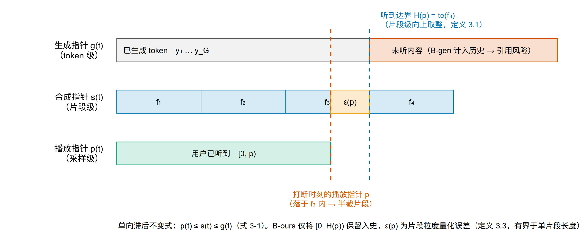

# 第三章 问题形式化

## 3.1 系统模型与符号

### 3.1.1 级联流水线

考虑级联式流式语音对话系统

$$
\mathcal{S}=\langle \mathrm{ASR},\mathrm{LLM},\mathrm{CHK},\mathrm{TTS},\mathrm{PLY}\rangle,
$$

其中各模块按流水线衔接。

- **流式 ASR** 将用户语音转写为稳定文本段序列 $U=\langle u_1,u_2,\ldots\rangle$。本文下游仅接收不再修正的 final segment，而不直接消费可撤销的 partial transcript。
- **LLM** 维护对话上下文的 KV 缓存 $\mathcal{K}$。用户文本段到达后增量预填充，assistant 回复以零起始的内容 token 序列 $Y=\langle y_0,\ldots,y_{G-1}\rangle$ 逐步生成。
- **断句器 CHK** 将 assistant 内容 token 流切分为 TTS 文本片段 $F=\langle f_1,\ldots,f_m\rangle$。每个片段关联一个左闭右开的 token 区间：

$$
f_j\mapsto[\operatorname{ts}(f_j),\operatorname{te}(f_j)),\qquad
\operatorname{ts}(f_1)=0,\quad
\operatorname{ts}(f_{j+1})=\operatorname{te}(f_j).
$$

  本文以 TTS 文本片段作为历史裁剪的原子单位。
- **流式 TTS** 接收完整文本片段并输出一个或多个音频块。片段 $f_j$ 在累计软件音频轴上占据采样区间 $[\operatorname{ss}(f_j),\operatorname{se}(f_j))$，采样率记为 $r$。
- **播放器 PLY** 顺序消费已登记音频块并维护软件已消费采样游标 $p\in\mathbb{N}$。$p$ 采用计数语义，即软件播放器已经消费区间 $[0,p)$。

本文固定使用“ASR 稳定文本段”表示 $u_i$，使用“TTS 文本片段”表示 $f_j$，以避免两类片段混淆。

### 3.1.2 三层播放语义与异构进度

本文严格区分三个层级：

1. **软件已消费采样（software-consumed samples）**：播放器线程或 headless harness 报告已经消费的采样数，即本文的 $p$；
2. **设备已呈现采样（device-presented samples）**：已经通过音频 API、操作系统、驱动和设备缓冲并由设备呈现的采样；
3. **声学上被听到的内容（acoustically heard content）**：经过扬声器与传播路径后到达用户并可能被感知的内容。

本文只观测第一层。由于应用队列、音频 API、操作系统、驱动、设备及传播路径均可能引入尚未测量的缓冲或延迟，$p$ 不等于设备已呈现采样数，也不构成用户声学上实际听到内容的真值。“播放感知”在本文中因此专指**软件已消费采样游标驱动的 TTS 片段级状态操作**。

在时刻 $t$，系统同时维护三种原始进度：生成内容 token 端点 $G(t)$、已登记到 TTS/软件播放时间轴的最大文本片段 token 端点 $S(t)$，以及软件已消费采样游标 $p(t)$。三者分别处于 token 域和采样域，不能直接写成 $p(t)\leq S(t)\leq G(t)$。

系统只把软件游标映射到**命中的 TTS 文本片段**，并以该片段的 token 末端作为软件保留边界 $\widehat H(p)$。在“软件播放器只消费已登记片段、片段按生成顺序入队”的假设下，比较对象均转换为 token 端点后有

$$
\widehat H(p(t))\leq S(t)\leq G(t). \tag{3-1}
$$

式（3-1）描述的是本文软件时间轴的生产者顺序约束，而不是设备或声学播放规律。只要打断时 $\widehat H(p)<G$，按生成边界保留历史就可能纳入软件游标尚未覆盖的片段内容。

端到端帧同步模型可以减少独立 TTS 引入的错位，但网络和播放缓冲仍可能使模型产出、设备呈现与声学到达位置不同；因此本文不将“端到端”简单等同于三种进度完全一致。

**图 3-1　三种异构进度与片段级软件保留边界。** 软件已消费采样游标 $p$ 落在片段 $f_3$ 内，片段级保留边界吸附到 $\widehat H(p)=\operatorname{te}(f_3)$。片段中游标尚未覆盖的文本尾部由定义 3.3 的字符比例—空白边界代理估计；该图不表示设备呈现或声学听觉真值。

## 3.2 软件游标与片段级历史对齐

**定义 3.1（TTS 片段级软件保留边界）**　若软件已消费采样游标 $p$ 落在片段 $f_k$ 的累计采样区间内，即

$$
\operatorname{ss}(f_k)<p\leq\operatorname{se}(f_k),
$$

则定义

$$
\widehat H(p)=\operatorname{te}(f_k). \tag{3-2}
$$

若 $p=\operatorname{se}(f_k)$，软件游标恰好覆盖片段边界；若 $p<\operatorname{se}(f_k)$，则软件仅消费了该片段的一部分。式（3-2）选择把命中片段整体保留在历史中，从而避免在缺少片段内文本—音频对齐时裁剪到任意 token。

当 $p=0$ 时，表示软件播放器尚未消费推测内容，定义 $\widehat H(0)=0$。若游标越过全部已登记音频，则边界钳制到最后一个具有音频记录的片段末端；仅当本轮全部 assistant 内容均已登记时，该端点才等于本轮 assistant 内容结束位置。

**定义 3.2（片段级软件历史对齐）**　设本轮 assistant 内容相对起点的保留范围为 $[0,\widehat H(p))$。若打断后对话历史及其 KV 表示只保留该范围，则称其满足 TTS 片段级软件历史对齐：

$$
\mathcal{H}_{\mathrm{frag}}=
\langle y_0,\ldots,y_{\widehat H(p)-1}\rangle. \tag{3-3}
$$

作为对照，按生成位置保留的历史为 $\mathcal{H}_{\mathrm{gen}}=\langle y_0,\ldots,y_{G-1}\rangle$。当 $G>\widehat H(p)$ 时，区间 $[\widehat H(p),G)$ 对应完整的游标外片段或其后续内容。

需要强调，式（3-3）保证的是**软件游标与片段操作语义下的保留一致性**，不是设备已呈现或声学上被听到内容的逐 token 真值。本文实现没有设备时钟、loopback 波形、TTS 词级 duration 或强制对齐，因而不能从 $p$ 推得真实 token 播放位置。工件中的 legacy 字段 `heard_text`、`n_heard` 与 `strict_unheard` 仅为兼容别名，其操作语义分别限于片段保留或字符比例—空白吸附代理。

**定义 3.3（字符比例—空白边界代理）**　当 $p$ 命中片段 $f_k$ 且软件只消费了该片段的一部分时，定义片段内软件消费比例

$$
\alpha(p)=\frac{p-\operatorname{ss}(f_k)}{
\operatorname{se}(f_k)-\operatorname{ss}(f_k)}.
$$

设片段文本长度为 $L_k$ 个字符，先计算原始字符切点

$$
c_{\mathrm{raw}}=\operatorname{round}\bigl(\alpha(p)L_k\bigr),
$$

再将其向前移动到最近的空白边界，得到 $c_{\mathrm{ws}}$。文本后缀

$$
W_{\mathrm{tail}}(p)=f_k[c_{\mathrm{ws}}:L_k] \tag{3-4}
$$

作为命中片段中软件游标尚未覆盖部分的代理。该口径是**字符比例—空白边界近似**，既不是音素/词级对齐真值，也不是 token 域线性插值，更不测量人类感知。它只用于第六章分析片段级向上吸附可能带来的文本尾部风险。

本文包含两类状态修正事件：播放期用户打断按 $\widehat H(p)$ 保留历史；未被接受的候选响应作废时，缓存回滚到该次推测之前的 user-open 端点，对应 $p=0$ 和 $\widehat H=0$，但其裁剪点来自推测状态快照而非时间轴查询。

## 3.3 反向查询与持久化模型状态

**定义 3.4（软件游标反向查询）**　给定软件已消费采样游标 $p$，关联时间轴执行

$$
\Phi:p\longrightarrow
f_k\ \text{s.t.}\ \operatorname{ss}(f_k)<p\leq\operatorname{se}(f_k)
\longrightarrow[\operatorname{ts}(f_k),\operatorname{te}(f_k))
\longrightarrow\widehat H(p). \tag{3-5}
$$

时间轴记录片段关联的 `chunk_ids`，但当前反查按片段聚合采样区间定位，并不从采样位置解析到某个具体音频块。$\Phi$ 是由生产者不变式维护的关联与反向索引，不是采样、音频块、文本与 token 四层之间的可逆双射。

令持久化模型状态为

$$
\mathcal{Z}=\langle\mathcal{K},M,I,A,\varphi,e,a_0,a_1\rangle,
$$

其中 $\mathcal{K}$ 为 `DynamicCache`，$M$ 为 attention mask，$I$ 为覆盖完整缓存序列的 `token_ids` ledger，$A$ 为仅含当前 assistant **内容 token** 的 `assistant_token_ids` ledger，$\varphi$ 为 `RolePhase`，$e$ 为 `GenerationEndReason`，$[a_0,a_1)$ 为当前 assistant 内容 span。任何稳定状态都必须满足

$$
|I|=|M|=\operatorname{seq}(\mathcal{K}),\qquad
A=I[a_0:a_1].
$$

`RolePhase` 至少区分 user role 已打开、assistant role 已打开以及 `ASSISTANT_EOT_PENDING`。`GenerationEndReason` 显式记录 `NONE`、`EOS`、`MAX_TOKENS`、`CONSUMER_STOP` 或 `CROPPED`，不能再由生成长度或账本末 token 反推。

当生成器选择结构性 EOT 时，该 EOT 只触发 `ASSISTANT_EOT_PENDING` 并把结束原因置为 `EOS`：它不进入 $A$、TTS 时间轴，也不作为 assistant 内容 token forward 进 $\mathcal{K}$。随后 `reopen_user_role()` 是提交 assistant close 的唯一入口；它恰好一次把模板推导出的结构性 EOT 与 user-open token 写入全局 ledger $I$ 和 KV。由此，预测 EOT 与结构 close 不会重复注入，同时结构 token 始终不计入 assistant 内容 span。

设当前 assistant 内容在整段 KV 序列中的绝对起点为 $a_0$，播放期裁剪位置为

$$
N=a_0+\widehat H(p).
$$

状态恢复分为两个阶段。

**定义 3.5（裁剪阶段合法性）**　裁剪至 $N$ 后，应满足：

1. KV 序列长度、注意力掩码长度和全局 `token_ids` ledger 长度均为绝对端点 $N$；本轮 assistant 内容账本长度为 $N-a_0=\widehat H(p)$；
2. 被移除的 assistant 内容 token 不再出现在 KV、掩码、全局 ledger 和 assistant 内容 ledger 中；
3. 下一次预填充使用裁剪后的实际 past length 构造连续位置编码；
4. 裁剪不得落在 role/EOT 等结构 token 内部，`RolePhase`、assistant span 和 `GenerationEndReason.CROPPED` 必须与裁剪后的 token 序列一致。

播放期保留零个 assistant 内容 token 时，裁剪到 $a_0$，assistant role 仍为打开状态，随后由正常 close 路径结束该轮。整段推测作废则裁掉 assistant header，回到推测前的 `USER_OPEN` 端点，以便继续追加用户文本。`CROPPED` 是当前阶段状态而非永久事件日志：crop 后、任何新内容推进前必须可见；`prefill_user_text()` 成功追加新 user 内容后必须立即重置为 `NONE`，避免陈旧裁剪原因污染下一生成阶段。

**定义 3.6（角色恢复阶段合法性）**　设 `reopen_user_role()` 从 tokenizer chat template 推导出的 assistant close 与下一 user-open 结构串包含 $q$ 个 token。该串提交后，KV、注意力掩码和全局 ledger 的绝对端点均为 $N+q$；结构串不计入本轮 assistant 内容账本，账本仍保存 $\widehat H(p)$ 个内容 token。下一轮 user 文本从位置 $N+q$ 开始，角色阶段为 `USER_OPEN`，结束原因为 `NONE`。

## 3.4 评测指标

### 3.4.1 候选计算与接受事件

E1/E2 的同步受控 harness 区分五类事件：

- **最后段到达** $t_{\mathrm{arr}}$（`last_segment_arrival`）：最后一个预切分稳定文本段进入 LLM 输入路径；
- **首候选 token 选择** $t_{\mathrm{cand}}$（legacy `first_token_ready`）：生成循环选出首个 candidate token 后的内部回调。该回调早于 cache-update forward 和 generator `yield`，只表示 first-candidate-token selection / candidate compute-readiness；
- **候选后 oracle 接受** $t_{\mathrm{acc}}$（`endpoint_accept`）：同步 harness 在候选处理之后，以用户话轮真值终点接受或作废候选；它不是自然端点检测器输出，也不是最后文本段到达瞬间；
- **首可交付诊断标记** $t_{\mathrm{diag-deliv}}$（`first_deliverable_token`）：同步程序按自身接受顺序记录的 marker；
- **consumer 诊断标记** $t_{\mathrm{diag-cons}}$（`consumer_delivery`）：同步程序记录的 consumer-observation marker。

后两者只用于诊断 harness 执行顺序，不代表生产 deliverability、TTS admission、设备播放或声学输出。特别是，`first_token_ready` 不应解释为“可被下游消费”。

**到达—首候选选择延迟**是内部计算指标：

$$
L_{\mathrm{arr}\to\mathrm{cand}}=t_{\mathrm{cand}}-t_{\mathrm{arr}}. \tag{3-6}
$$

该指标度量最后段到达后至首个候选 token 被选择的墙钟时间，不度量 gate-authorized token、consumer-observed TTFT 或首块音频响应。

**oracle 接受后候选延迟下界 $\mathrm{TTFT}_{\mathrm{eff}}$** 是同步接受策略下的乐观下界；保留 `TTFT` 符号只为与既有 artifact 兼容，不表示 production first-token delivery：

$$
\mathrm{TTFT}_{\mathrm{eff}}=
\begin{cases}
0, & \text{若 } t_{\mathrm{acc}} \text{ 时存在存活且已选择的候选};\\
t_{\mathrm{diag-deliv}}-t_{\mathrm{acc}}, & \text{否则}.
\end{cases} \tag{3-7}
$$

式（3-7）回答的是“若 post-candidate oracle 在接受时立即采用存活候选，可获得何种条件性下界”，不是实际可交付或用户感知时延。候选首选到 oracle 接受的间隔也仅是同步程序内部间隔，不能解释为自然端点提前量或用户继续说话时长。第六章单列 $t_{\mathrm{diag-deliv}}$ 与 $t_{\mathrm{diag-cons}}$，用于暴露同步执行顺序，而不将其作为系统 headline。

**推测触发到首候选选择延迟 $\mathrm{TTFT}_{\mathrm{spec}}$**：推测阈值被触发到首个候选 token 被选择的墙钟时间。该指标描述触发—候选计算链路，不表示内容已经获准进入 TTS 或播出。

**mouth-to-ear 延迟**：用户话轮结束到首块音频可播放的时间。第六章只将 LLM 计算墙钟时间与 TTS 画像组合建模；该数值不是实际音频闭环、设备呈现或声学到达的端到端实测。

**KV 裁剪操作延迟 $L_{\mathrm{crop}}$**：孤立执行缓存裁剪的墙钟时间。A1 的主要恢复指标 $L_{\mathrm{joint}}$ 在同一 GPU 同步计时区间内依次执行 crop 与角色恢复，并与重新预填充的逐次墙钟计时比较。A1 固定操作顺序、固定移除 32-token suffix，每个上下文长度包含 5 次预热与 50 次重复；因此其结果只描述该固定协议，不代表自然打断位置或其他裁剪长度。

**Prepared-state 软件控制路径延迟**：P1 在播放器启动前完成目标 KV 状态恢复和 CUDA/GPU 设备同步，并把该准备时间记为 $L_{\mathrm{setup}}$，但将其排除在 stop 路径之外。stop 请求发出后，分别记录软件播放器确认 $L_{\mathrm{ack}}$、确认后的 CUDA/GPU 同步 $L_{\mathrm{sync}}$ 和时间轴反查 $L_{\Phi}$；同时定义两个从同一 stop 请求时刻起算的累计端点：

$$
L_{\mathrm{stop\to crop}}=t_{\mathrm{crop\ done}}-t_{\mathrm{stop\ request}},\qquad
L_{\mathrm{stop\to role}}=t_{\mathrm{role\ done}}-t_{\mathrm{stop\ request}}. \tag{3-8}
$$

$L_{\mathrm{stop\to crop}}$ 已嵌套包含软件停播确认、播放器确认后的 CUDA/GPU 同步、$\Phi$ 查询和同步 KV 裁剪；$L_{\mathrm{stop\to role}}$ 又嵌套包含前者及角色恢复。各区间中位数不能相加，P1 与另一 campaign 的 A1 也不能通过相减解释系统开销。P1 只覆盖 9 个 cell、每 cell 20 次的 headless 软件路径；其 P95 是经验性、描述性的 order statistic，主要由每 cell 的一至两个上尾观测决定，不是生产 SLO。

### 3.4.2 一致性指标

设固定首轮生成轨迹中 playback 片段边界之后、generation 条件额外保留的差异文本为 $W$，其后两轮回复集合为 $R$。固定轨迹 E3 在两种历史条件下使用完全相同的 $W$，并记录后续回复是否复现其中的信息。本文采用两种目标口径。

- **片段目标（fragment）**：$W_{\mathrm{frag}}$ 为片段级 software-cursor 端点之后的共享差异文本。只有当该目标非空时，配对记录才进入片段目标分析。
- **字符比例—空白边界近似目标（proxy）**：$W_{\mathrm{proxy}}$ 将式（3-4）的命中片段文本尾部与 $W_{\mathrm{frag}}$ 拼接。该口径纳入片段内代理尾部，但不是设备或声学边界；其分析资格必须依据 $W_{\mathrm{proxy}}$ 自身是否非空确定。

引用判定使用固定词面规则与固定 `specific-reference-v3` Mistral judge。E3 的 estimand 是**固定检测器条件下的信息复现率**，不是人类语义真值或 HCI 效果。区间只表示在冻结规则、裁判、目标、轨迹、提示词与 40-token cap 条件下的 dialogue-sampling uncertainty，不包含检测器误差、提示词/模型变动或人类感知误差。

同时，本文区分“software-cursor 条件是否写入局部完整游标外文本”这一结构合规问题和“共享差异文本是否在后续回复中复现”这一代理后果。前者是可由边界和文本长度直接检查的构造性性质；后者只能由固定规则或模型代理估计。结构检查不得与语义代理分析的分母合并。

### 3.4.3 效率指标

推测浪费率定义为

$$
\rho=\frac{\sum\text{作废的候选 token 数}}
{\sum\text{作废的候选 token 数}+\sum\text{最终生成 token 数}}. \tag{3-9}
$$

式（3-9）的 pooled 口径与确认性 E1/E2 campaign 的正式 estimand 相同。八个数值阈值和一个 never-speculate 对照构成九个 B-path 工作点：

$$
\bigl(\rho(\theta),\mathrm{TTFT}_{\mathrm{eff}}(\theta)\bigr).
$$

阈值降低通常提高候选生成覆盖率，也可能增加作废计算。第六章同时报告各工作点的到达—首候选选择延迟与候选存活率；有限个测试点只能支持受控工作点刻画，不自动构成连续或严格单调的 Pareto 前沿。

KV 复用收益通过“重新预填充耗时中位数 / 同一计时区间联合执行 crop 与角色恢复的耗时中位数”描述。该比值只适用于 A1 的固定顺序和固定 32-token suffix 协议。本文以联合路径为主要分母，并把 crop-only、role-only 作为局部诊断；不以两个独立中位数之和替代联合路径中位数。

### 3.4.4 实验单位与路径可比性

确认性 E1/E2 采用 $100$ 个唯一话语与 $5$ 个独立初始化进程 session 的交叉设计。每条件共有 $100\times5=500$ 个 session×utterance 观测，但内容采样单位是 100 个唯一话语，session 是技术重复，不把 500 个观测解释为 500 个独立内容样本。正式 `analysis_v2` 使用 crossed/product bootstrap：独立重采样全局 session 与全局话语，再取笛卡尔积；重复 10,000 次，seed 为 20260901，并报告 percentile 95% 区间。

C-E1 比较一次性 full-string tokenization/full-prefill 的 System A 与 segment-wise tokenization/incremental 的 B@0.92。由于两条路径不保证 token 等价，C-E1 是**实现路径比较**，混合 tokenization、forward topology/shape、role boundary、kernel 与 Python scheduling，不能归因为纯 incremental-prefill 效应。C-E2 比较 B@0.92 与 B-never，两者沿相同 B-path 且正式记录的 token 输出一致，可用于 B 路径内部的阈值策略比较。主延迟分析不能只筛选 C-E1 输出相同的记录，因为这会形成结果之后的选择。

### 3.4.5 指标与实验对应关系

| 研究问题 | 主要指标 | 实验 |
|---|---|---|
| 固定轨迹下两种历史边界的固定检测器条件信息复现率有何差异 | 片段目标、字符比例—空白边界近似目标 | E3 |
| 推测阈值如何影响候选计算与 oracle 响应下界 | $\rho$、$L_{\mathrm{arr}\to\mathrm{cand}}$、候选存活率、$\mathrm{TTFT}_{\mathrm{eff}}$ | E2（同时作为 A3） |
| 两条非 token-equivalent 实现路径在受控文本输入下的指标有何差异 | $L_{\mathrm{arr}\to\mathrm{cand}}$、诊断 markers、$\mathrm{TTFT}_{\mathrm{eff}}$、建模 mouth-to-ear | E1 |
| KV 状态复用及软件控制路径的时延表现如何 | A1 固定协议下联合 crop+角色恢复/重新预填充耗时；P1 软件 stop 确认、反查及累计恢复端点 | A1、P1 |
| 当前探索性运行中三种历史处理实现的表现如何 | 连贯性评分、重写耗时 | A2 |

## 3.5 本章小结

本章把 $p$ 限定为 software-consumed-sample cursor，并将其与 device-presented samples 和 acoustically heard content 分开；$\widehat H(p)$ 仅表示 TTS 片段级软件保留边界。持久化状态显式包含全局 `token_ids` ledger、assistant 内容 ledger、`RolePhase`、`GenerationEndReason` 与内容 span；预测 EOT 进入 `ASSISTANT_EOT_PENDING`，不进入内容账本、时间轴或内容 KV，由 `reopen_user_role()` 唯一提交结构 close。延迟口径改为首候选 token 选择/内部计算就绪、候选后 oracle 接受以及仅供诊断的 first-deliverable/consumer markers，不再作生产可交付性推断。最后，本章明确了 100 个唯一话语与 5 个 session 的交叉设计、C-E1 的非 token-equivalent 实现路径边界、A1 固定 32-token suffix 和 P1 经验 P95 的适用范围。