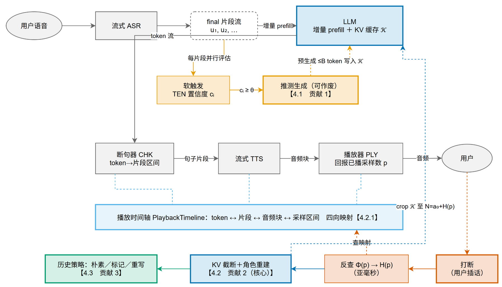
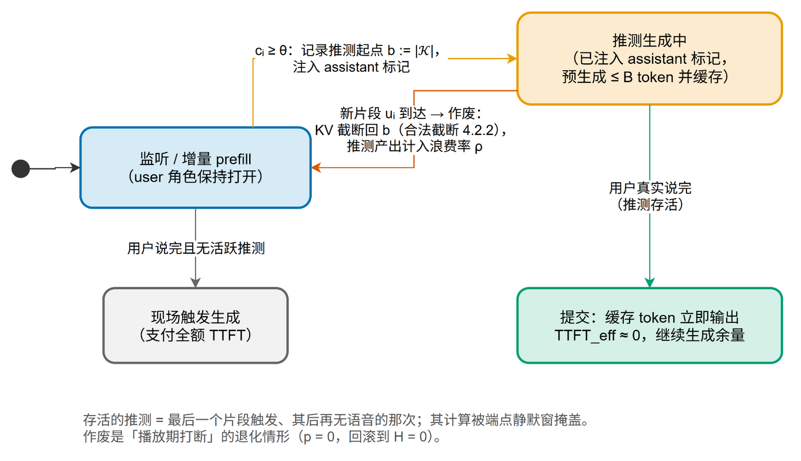
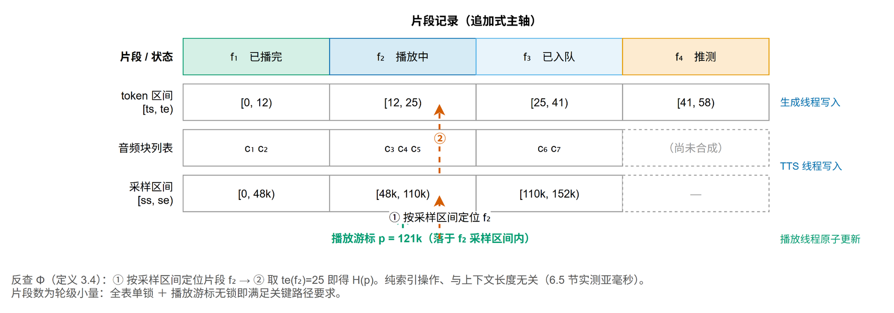
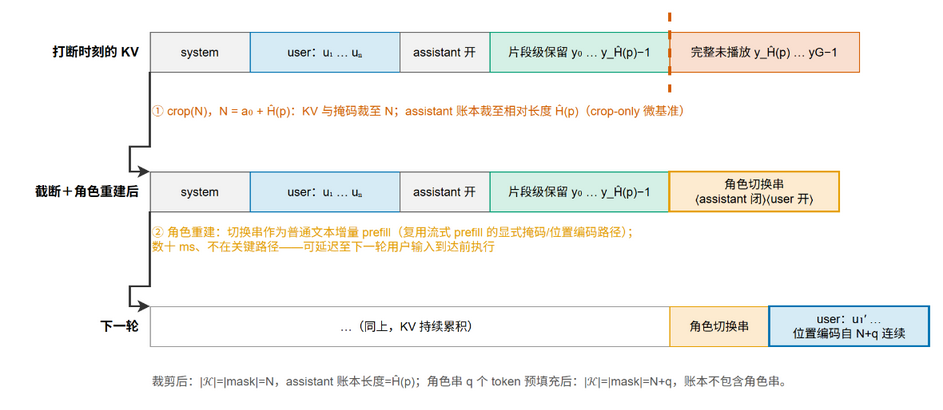

# 第四章 方法设计

## 4.1 总体设计

本文在本项目一期内部实现的“流式 ASR 稳定文本段—LLM 增量 KV 预填充”流水线之上，增加输出断句、流式 TTS、软件播放时间轴和打断状态修正，形成图 4-1 所示闭环。

**图 4-1　系统总体架构。** 输入侧以稳定 ASR 文本段驱动增量预填充和候选生成；输出侧将内容 token 流切分为 TTS 文本片段并登记音频块；打断侧依据 software-consumed-sample cursor 查询片段级保留边界，执行 KV 裁剪和角色恢复，并可选用历史自然化策略。

系统遵循两项设计原则。第一，打断后的历史按软件游标对应的 TTS 片段边界保留；这一高层思想已有工程先例，本文的核心是把 software cursor、片段、assistant token span、KV、mask、token ledger、position、role 与 EOT 状态组成可检查的跨层契约。第二，话轮结束前生成的候选必须可作废、可计量并可由阈值调节。本文的 speculation 是 **pre-end-of-turn candidate-response generation with invalidation**，不是 draft-target speculative decoding。

这里的 playback-aware 不表示设备或声学观测。本文只取得软件播放器消费的采样游标；设备已呈现采样和用户声学上听到的内容需要设备时钟、loopback 或其他物理测量，均未由本方法实例化。

## 4.2 可作废的候选响应生成

### 4.2.1 单一推测阈值与候选后接受

TEN Turn Detection 对累计文本给出连续置信度

$$
c_i=\operatorname{conf}(u_1\cdots u_i)\in[0,1],
$$

并以单一推测阈值 $\theta$ 控制话轮结束前的候选响应生成。当 $c_i\geq\theta$ 时，系统冻结推测前状态快照，打开 assistant role，并预生成不超过预算 $B$ 的候选内容 token。$B$ 限制单次误触发的计算成本。

首个候选 token 被选择时触发内部回调；回调位于 token selection 之后、cache-update forward 与 generator yield 之前。因此该事件只表示 first-candidate-token selection / candidate compute-readiness，不表示 token 已获准交付、consumer 已观察、TTS 已接纳或已经产生声学输出。

同步实验 harness 在候选处理之后使用用户话轮真值终点执行 `endpoint_accept`。该事件是 **post-candidate oracle acceptance**，不是自然端点检测输出，也不是最后文本段到达瞬间。harness 另记录 `first_deliverable_token` 与 `consumer_delivery`，但二者仅作为暴露同步执行顺序的诊断 marker，不能据此推断 production deliverability。面向在线部署可以另设独立的播出门控；本文没有实现或验证该门控。

话轮置信度计算与当前文本段的增量预填充在目标架构中可以并发，但“可以并发”不等于无条件零开销。实际能否掩蔽触发模型延迟取决于资源隔离、调度和两条计算链的完成时序。

### 4.2.2 推测—作废状态机

对每个到达的 ASR 稳定文本段 $u_i$，系统执行以下步骤。

1. 若存在活跃候选，则新文本段表明用户仍在说话。系统将 KV、mask、完整 `token_ids` ledger、assistant 内容 ledger 及 role 状态原子地裁剪回该次推测前的 `USER_OPEN` 快照，并记录作废内容 token 数。整段作废同时移除 assistant header，而不是在 assistant role 内保留零内容。
2. crop 完成后 `GenerationEndReason.CROPPED` 必须暂时可见；随后在 `USER_OPEN` 阶段增量预填充 $u_i$。用户文本成功追加即表示进入新输入阶段，陈旧的 `CROPPED` 被重置为 `NONE`。
3. 计算 $c_i$；若达到阈值，则记录新的推测前状态，打开 assistant role，并生成至多 $B$ 个候选内容 token。
4. 用户话轮真值终点到达时，post-candidate oracle 若接受存活候选，则沿其持久化状态继续生成；若没有可接受候选，则按需打开 assistant role 并生成。

**图 4-2　推测—作废状态机。** 新文本段到达会使先前候选作废并恢复至推测前 `USER_OPEN` 状态；真值话轮终点在候选处理之后执行 oracle acceptance。首候选选择、oracle 接受、诊断 deliverable marker 和 consumer marker 是不同事件。

八个数值阈值加一个 never-speculate 对照得到九个有限工作点。它们描述同步受控 harness 中的候选计算、oracle 响应下界、存活率与浪费率，不预设曲线严格单调，也不证明异步在线系统的可交付时延改善。

## 4.3 软件游标驱动的 KV 缓存管理

### 4.3.1 片段关联时间轴及生产者合同

反向查询 $\Phi$ 由 `PlaybackTimeline` 支撑。每条片段记录包含

$$
\langle f_j,[\operatorname{ts},\operatorname{te}),
\text{音频块列表},[\operatorname{ss},\operatorname{se}),\text{状态}\rangle.
$$

生成侧登记 token 区间，TTS 侧附加音频块并推进累计软件采样轴，播放器维护 software-consumed-sample cursor。打断到达时，时间轴依据累计采样区间定位当前片段，并返回 $\widehat H(p)=\operatorname{te}(f_k)$。这种结构是“四层关联与反向索引”，不是四层之间的严格双向映射，也不把软件采样轴提升为设备或声学真值。

**图 4-3　片段关联时间轴与反向查询。** TTS 文本片段是内容 token 区间、音频块和累计软件采样区间的共同主键；软件游标通过片段记录解析为 KV 内容裁剪点。

该查询的成立依赖写入侧不变式，接口以 fail-closed 方式强制以下合同：

1. `add_fragment()` 的 token span 必须非空、单调且与上一片段连续，禁止重叠、倒退或跨越未登记 token；
2. 一个片段只有在其 token span 冻结后才接受音频块；已关闭或已进入终态的片段不得再附加 chunk；
3. 每个 `chunk_id` 全局唯一且只能归属于一个 fragment，`attach_chunk()` 必须按片段与 chunk 顺序调用；
4. 音频块 sample range 必须非空、全局单调连续，片段的聚合 $[\operatorname{ss},\operatorname{se})$ 由其 chunk 序列唯一决定；
5. 软件游标只允许单调前进，并钳制在已登记采样范围内；
6. 任一 out-of-order fragment、重复/错属 chunk、sample gap/overlap、关闭后追加或游标倒退均被拒绝，而不是静默重排。

这些约束使式（3-1）成为接口不变式。锁用于序列化短小的轮级时间轴更新，但不取代上述语义验证。

断句器只接收解码文本，不直接感知 token。系统为每个生成 token 累计非空白字符数；断句器产出片段后，再按片段的非空白字符长度在前缀和中定位片段末 token。该方法能够容忍空白归一化，并通过“片段拼接后的非空白字符序列等于原始解码序列”检查守恒性。

部署目标中，生成、TTS 和软件播放可以由独立执行单元并发推进。实验中的 Mock TTS 与 headless player 共享接口和软件边界语义，但模拟不能代表真实 TTS 队列、audio API、OS/驱动/设备缓冲或声学停播。

### 4.3.2 统一持久化状态与 KV 裁剪

缓存容器不是单一 KV 对象，而是

$$
\langle\mathcal{K},M,I,A,\varphi,e,a_0,a_1\rangle,
$$

即 `DynamicCache`、attention mask、完整 `token_ids` ledger、assistant 内容 ledger、`RolePhase`、`GenerationEndReason` 及 assistant 内容 span。所有 token 追加均通过同一 token-ID prefill 核心，并在稳定点检查

$$
|I|=|M|=\operatorname{seq}(\mathcal{K}),\qquad A=I[a_0:a_1].
$$

时间轴返回相对边界 $\widehat H(p)$ 后，系统将其转换为绝对缓存端点 $N=a_0+\widehat H(p)$，并同步执行：

1. 调用 `DynamicCache.crop(N)` 缩短每层 K/V；
2. 将 attention mask 与完整 `token_ids` ledger 裁剪至 $N$；
3. 将 assistant 内容 ledger 与内容 span 裁剪至同一语义边界；
4. 从裁剪后的真实 past length 构造后续 position IDs；
5. 恢复与剩余 token 序列一致的 `RolePhase`，并把当前 end reason 标记为 `CROPPED`。

只裁剪 KV 而不更新 mask 或 token ledger，会破坏缓存长度与可审计 token 序列的一致性；只更新文本历史而保留旧 KV，则模型仍可访问已删除状态。结构 token 内部不是合法 crop 点。播放期保留零个内容 token 时裁剪到 assistant content start，保持 `ASSISTANT_OPEN`，再由正常关闭路径提交 EOT；整段候选作废则裁剪到 assistant role start 之前并移除 assistant header，恢复 `USER_OPEN`。

A1 在每个上下文长度进行 5 次预热和 50 次重复，所有 trial 采用固定 operation order，并固定移除 32-token suffix。CUDA/GPU 前后同步包围同一计时区间内的 crop 与角色恢复。该微基准不包含时间轴查询、播放器停止、线程调度或服务通信，且不能代表自然打断位置、其他 crop length 或随机化执行顺序。

P1 使用 prepared-state 屏障：每次 trial 先恢复目标 KV 状态并完成 CUDA/GPU 同步，再启动 headless 墙钟节拍软件播放器。stop 路径依次记录软件线程确认、确认后的 CUDA/GPU 同步、时间轴反查、同步裁剪和角色恢复完成端点。stop→crop 与 stop→role 是嵌套累计区间。P1 每个 cell 只有 20 个观测，P95 只作为 empirical/descriptive order statistic；它不是稳定的 production SLO，也不覆盖设备呈现或声学停止。

### 4.3.3 EOT、角色边界与多轮恢复

KV 是连续 token 状态，role 信息由 chat template 特殊 token 表达。系统从 tokenizer 的规范 chat template 推导 user-open、assistant-open 与 assistant-close 转换，并验证 token-ID 序列，不依赖手写固定字符串。

生成循环逐 token 执行 selection 与 production append。普通内容 token 被 forward 进 KV，同时追加到全局 `token_ids` ledger 和 assistant 内容 ledger。若所选 token 是结构性 EOT，则执行不同路径：

1. 不把 EOT 作为 assistant 内容 forward 进 KV；
2. 不将其加入 `assistant_token_ids` 或 TTS fragment timeline；
3. 将 `RolePhase` 置为 `ASSISTANT_EOT_PENDING`；
4. 将 `GenerationEndReason` 显式置为 `EOS` 并停止内容生成。

`reopen_user_role()` 是唯一的 close commit：它在 `ASSISTANT_OPEN`（因 crop/consumer stop/max-token 而结束）或 `ASSISTANT_EOT_PENDING`（生成器预测 EOT）状态下，恰好一次预填充模板推导出的 assistant-close 与 user-open 结构 token。由于预测 EOT 尚未进入 KV，这一路径不会产生重复 EOT。结构串进入全局 ledger、mask 和 KV，但不进入 assistant 内容 ledger。完成后进入 `USER_OPEN`，end reason 重置为 `NONE`。

`GenerationEndReason` 是阶段状态而非永久日志。crop 后的 `CROPPED` 必须在新内容推进前可见；成功的 `prefill_user_text()`、`prefill_assistant_text()`、`open_assistant_role()` 或规范 reopen 会根据新阶段重置状态，其中 D-022 特别要求 user 内容一旦成功追加就清除陈旧 `CROPPED`。编排器另保存候选结束原因快照，避免为了保留审计信息而污染当前运行状态。

**图 4-4　KV 裁剪与角色边界恢复。** 第一步原子裁剪 K/V、mask、完整 ledger 与 assistant 内容 ledger；第二步依据裁剪语义恢复 `RolePhase`；第三步由 `reopen_user_role()` 唯一提交 assistant close 与下一 user-open。结构 EOT 不属于 assistant 内容。

### 4.3.4 C2 v3 direct crop-integrity 验证方法

C2 的正式正确性方法采用 protocol v3 exact-only addendum，而不是 clean re-prefill 对照。固定 Qwen2-7B snapshot、BF16、SDPA 与 Transformers backend，设置 24 个 ordered cases，覆盖 512/2048/8192 token context、$p=0$、片段边界、中段吸附、reply tail、pending EOT、推测全作废、下一轮与第二次 crop。24 个 case 共产生 27 个 ordered crop events，其中包含 3 个 no-op event；冻结 assistant fixture 共 308 个内容 token，必须全部经 `generate_accumulating` 的 production 路径逐 token append，每个 token 对应一次受控 `_prefill_ids_p2` forward。

每个 crop event 设三方 exact 比较：

1. **pre-crop retained prefix**：crop 前从 production K/V 取得目标长度前缀的逐层 manifest；
2. **production post-crop**：唯一调用生产 `crop_to_token()` 后的状态；
3. **independent slicing oracle**：从 crop 前 snapshot 独立 clone，并按推导出的 keep length 逐层切片，不调用生产 crop 接口。

三方逐层比较 K/V 的 shape、dtype、device、SHA-256 和 runtime `torch.equal`，并要求 keep length、mask、完整 token ledger、sequence length 与 KV length exact。wrong-length disposable negative control 必须对每个 event 被拒绝，以证明 gate 能检测错误保留长度。

crop 后，production arm 与 direct oracle 接收完全相同的 token-ID chunks，执行 60 个 matched-recovery steps。每一步要求 K/V、logits、mask、完整 token ledger、retained-prefix hashes，以及由操作序列独立推导的 role/end/content state bitwise/exact 一致。该设计验证的是受测 snapshot/backend 下的 direct crop integrity 与 matched-recovery determinism。

v1/v2 采用 canonical clean re-prefill 对照，均按冻结门槛 rejected。v2 虽然 24/24 termination probe 和 45/45 token/state/EOT/scenario gate 通过，但单控制的 2× numerical gate 仅 42/45。进一步审查发现 control 按语义 seam 分块并强制末 token 单独 forward，而 production 初始 context 和 role/content append 使用不同 forward topology，故该 control 不能识别三项数值失败来自 crop 还是拓扑差异。v3 没有把门槛事后放宽，也没有改判 v1/v2；它改问可由 exact slicing oracle 识别的问题。因此，v3 **不声称** crop+role 与 clean re-prefill 的数值、logit 或 continuation 等价，也不支持跨模型、dtype、backend、硬件、在线音频或生产端到端正确性。

### 4.3.5 对照条件的语义

- **按生成位置保留（B-gen）**：保留完整已生成回复。若 $G>\widehat H(p)$，则完整的 software-cursor 外片段可能进入历史。
- **重新预填充（B-noKV）**：丢弃 KV，根据裁剪后的文本重新执行模型前向。该条件只用于 A1 固定协议下的计算耗时对比；C2 v3 不以其作为数值等价 oracle。
- **按合成位置保留（B-syn）**：以合成边界修正历史。在本文同步 Mock TTS 条件下，它无法与 B-gen 形成可区分时序，故不作为已验证条件。

## 4.4 被打断历史的处理策略

片段级保留会把 software cursor 命中的当前片段整体写入历史，其中可能包含游标尚未覆盖的文本尾部；某些断句片段也可能在语义上不完整。本文在同一片段边界之上实现三种策略。

- **朴素策略**：直接保留片段级 assistant 前缀。
- **标记策略**：在保留前缀后追加省略号等打断标记。它不调用额外模型，但仍产生少量 tokenization 和预填充开销。
- **重写策略**：使用 Qwen3-0.6B 将保留前缀自然收束，并在提示词中要求不新增事实。该要求是设计约束而非形式保证；KV 需要回退到本轮 assistant 起点，再预填充重写文本。

重写可以在下一轮用户输入期间异步执行，因此具有隐藏部分延迟的潜力；当前实现和实验未测量真实重叠比例。现有 A2 为三种策略分别重新采样首轮和下一轮回复，未隔离策略效应，所以研究问题仅描述当前探索性运行的连贯性分数与重写耗时，不回答“是否改善”。

## 4.5 实验设计边界

确认性 E1/E2 是 100 个唯一话语与 5 个独立初始化进程 session 的交叉设计。每条件有 500 个 session×utterance observations，但 100 个话语是内容采样单位，5 个 session 是技术重复。正式 versioned `analysis_v2` 不覆盖 `analysis_v1`，而是使用 10,000 次 crossed/product bootstrap：独立抽样全局 session 与 utterance，再对二者笛卡尔积计算配对 estimand；seed 为 20260901，区间为 percentile 95%。

C-E1 的两条实现路径不是 token-equivalent：System A 对完整字符串一次 tokenization 并 full prefill；System B 对文本段分别 tokenization 并 incremental prefill。故 C-E1 估计整体 implementation-path difference，混合 tokenization、forward topology/shape、role boundary、kernel 与 Python scheduling，不能隔离纯增量预填充效应。正式输出检查只用于披露路径差异，不能据此过滤主延迟记录。C-E2 在相同 B path 内比较 B@0.92 与 never-speculate，输出 token 序列一致，因此具有更强的路径内可比性。

固定轨迹 E3 使用 label-weighted estimand 与同一口径的 dialogue-cluster bootstrap，并另报 dialogue-weighted 与 unique-semantic-boundary sensitivity。它量化固定检测器条件下的信息复现率，不支持 superiority、equivalence、noninferiority、harm、absence-of-effect 或人类感知结论。

## 4.6 本章小结

本章将辅助 C1 限定为话轮结束前候选生成的 selection/compute-readiness、post-candidate oracle acceptance 与浪费工作点刻画；把核心 C2 定义为 software cursor→TTS fragment→assistant token span→KV/mask/ledger/position/role/EOT 的状态契约。方法强制时间轴生产者顺序、不接受乱序写入；使用完整 token ledger、显式 `RolePhase` 和 `GenerationEndReason`；由 `ASSISTANT_EOT_PENDING` 与唯一 close commit 消除重复 EOT。C2 v3 以 24 cases、27 crop events 的三方 exact slicing 与 matched recovery 验证 direct crop integrity，不将已 rejected 的 clean-reprefill 协议改写为通过。最后，本章把 E1/E2 交叉重复、C-E1 非 token-equivalent 实现路径、A1/P1 协议边界及 A2 探索性定位纳入方法合同。