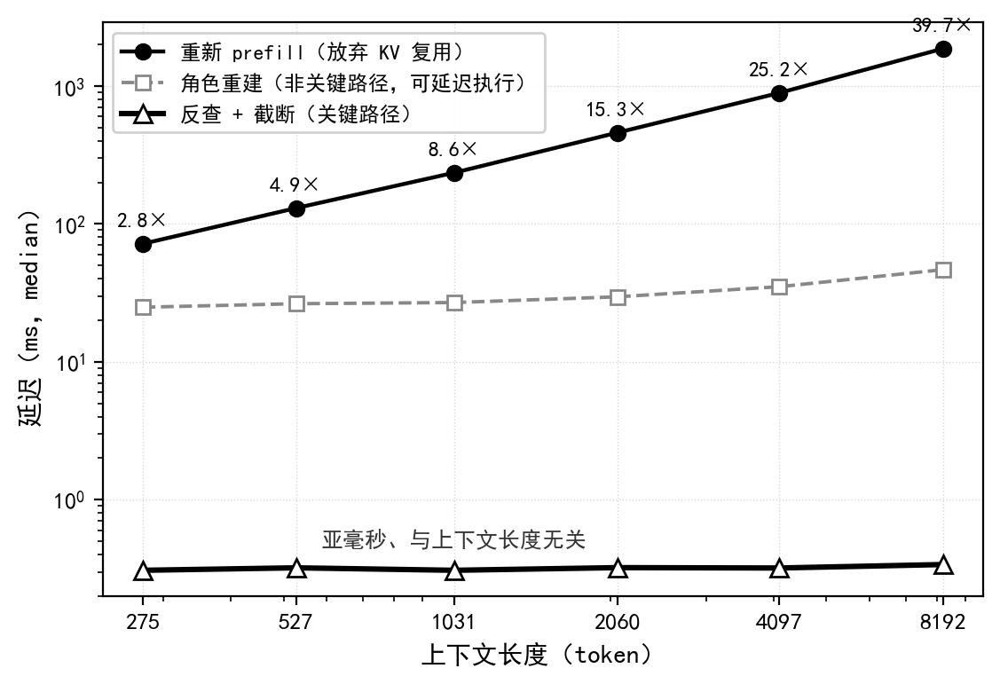
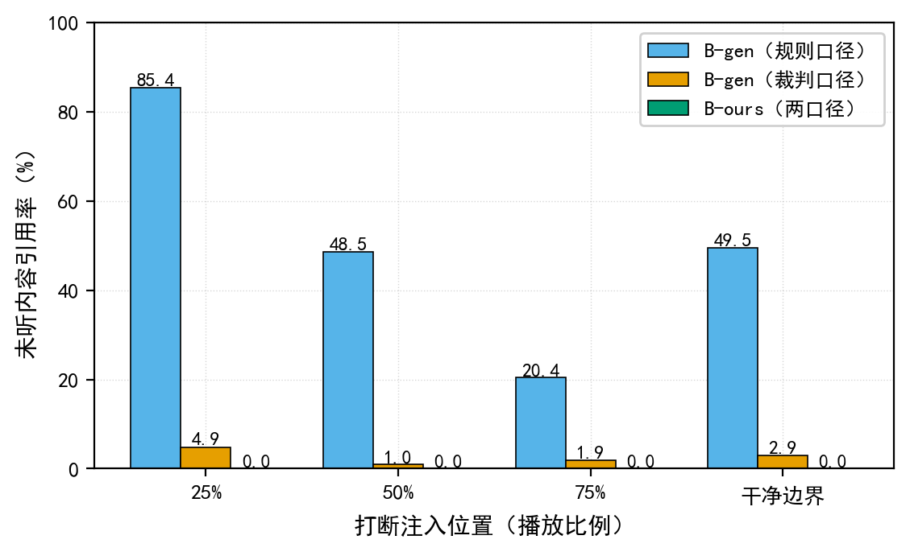
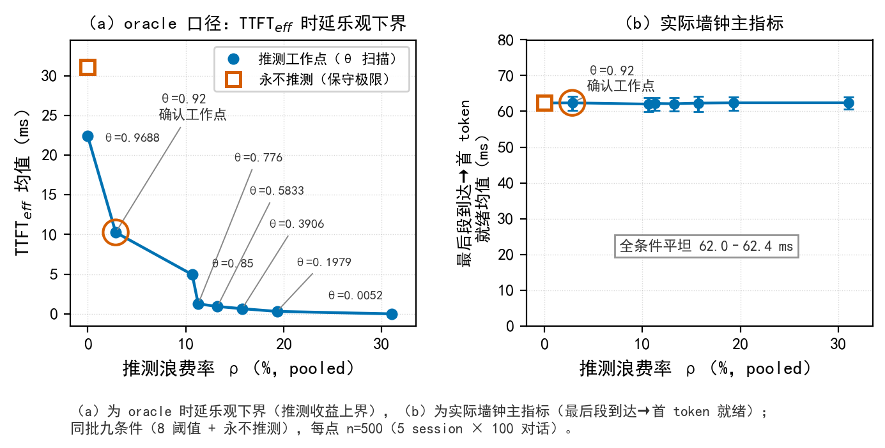
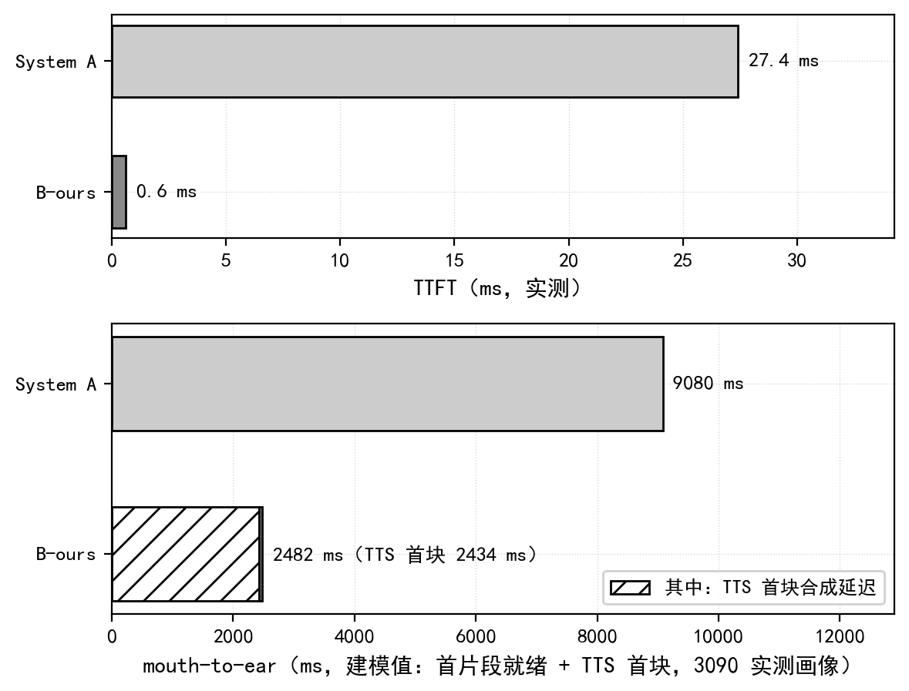

# 第六章 实验与结果分析

## 6.1 证据层级与实验设置

本章按 **C2→E3→C-E2→C-E1→A2** 报告证据。C2 是唯一核心机制贡献；E3 检查该机制所选择的软件保留边界对后续自动信息复现指标的下游影响；C-E2 与 C-E1 是支持性 C1 刻画；A2 仅为受混杂的探索性描述。研究问题依次为：

- **RQ1（C2）：** 冻结模型与后端下，production crop 是否保持指定缓存前缀，匹配双臂的恢复轨迹是否逐步精确一致？固定协议的模型侧成本和 prepared-state 软件路径时延如何？
- **RQ2（E3）：** 固定被打断轨迹与自动检测器下，software-cursor fragment retention 与 generation retention 的后续信息复现率有何差异？
- **RQ3（C-E2）：** 推测阈值如何影响 pooled discarded-token ratio、接受时候选可用率、候选选择/计算就绪和同步 oracle 时延下界？
- **RQ4（C-E1）：** 一次性预填充与增量推测两条非 token-equivalent implementation paths 的候选计算就绪有何差异？
- **RQ5（A2）：** 三种历史自然化实现的评分和重写耗时在本次探索性运行中呈现何种描述？

实验由 MultiWOZ 2.1[15] 派生。主模型为 Qwen2-7B-Instruct[11]；话轮检测器使用 TEN Turn Detection[12]；E3 自动裁判为 Mistral-7B-Instruct-v0.3[13]；TTS 时长画像由 CosyVoice2-0.5B[14] 采集；A2 重写模型为 Qwen3-0.6B[16]。确认性 C-E1/C-E2 使用 100 条唯一话语、5 个独立初始化进程 session 和 10 个条件，每条件 500 个 session×utterance 观测；内容采样单位仍是 100 条话语。固定轨迹 E3 包含 100 条对话、400 个 `(dialogue,injection_position)` 配对、800 条条件记录和 1600 条裁判记录。C2 v3、A1 与 P1 使用相互独立的正式工件；软件栈与硬件版本见表 5-2。

C-E1/C-E2 是同步预切分文本 harness，不包含真实音频、ASR 墙钟、在线 TEN 前向、TTS、播放器或声卡。raw `first_token_ready` 位于 token selection 之后、cache-update forward 与 generator yield 之前，故本文称其为**首候选 token 选择/内部计算就绪**。`endpoint_accept` 是候选处理后的同步 oracle 接受事件，不是自然端点检测输出；`TTFT_eff` 是该接受规则下的 **oracle latency lower bound**，亦即推测收益的乐观上界。

**表 6-1　证据层级与测量边界**

| 顺序 | 证据 | 角色与测量层级 | 主要限制 |
|---:|---|---|---|
| 1 | C2 v3 | 核心：direct crop integrity 与 within-run matched-arm recovery exactness | 不检验 clean re-prefill，不跨模型、后端、设备或在线系统 |
| 2 | E3 | C2 下游支持：固定检测器条件下的信息复现率 | 自动代理，不是人工或 HCI reference standard |
| 3 | C-E2 | C1：同一 B-path 内的阈值、候选可用性与 oracle 下界 | 同步 oracle，不识别真实端点前收益 |
| 4 | C-E1 | C1：非 token-equivalent implementation-path comparison | 不识别单一 incremental-prefill effect |
| 5 | A2 | C3：受混杂探索性描述 | 不具可识别的策略处理效应 |

播放侧 $p$ 仅表示 software-consumed-sample cursor；它及其片段保留边界均不等同于 device-presented samples 或 acoustically heard content。

## 6.2 RQ1：C2 直接裁剪完整性与匹配恢复

### 6.2.1 C2 v3 exact gate

C2 v3 在 Qwen2-7B-Instruct、BF16、SDPA 和 Transformers `DynamicCache` 的冻结环境中覆盖 24 个 case 与 27 个 crop event。308 个 fixture assistant 内容 token 均经 production append；另含 3 个 no-op、60 个 recovery step 和 27 个 wrong-length negative control。

slicing oracle 独立于 production crop 接口，但与 production arm 取自同一 pre-crop snapshot。对独立推导的 keep length $N$，它将每层 K/V 沿序列轴复制 `[..., :N, :]`，并同步复制 mask 与 token ledger 前缀；它不调用 `crop_to_token()`，也不进行 clean re-prefill。production arm 对对应快照唯一调用 `crop_to_token(N)`。

**表 6-2　C2 协议状态与允许结论**

| 版本 | 冻结结论 | 关键结果 | 允许解释 |
|---|---|---|---|
| v1 | rejected | 冻结等价门未通过 | 仅作失败协议记录 |
| v2 | rejected | 结构检查通过；单控制数值门 42/45 | control 与 production forward topology 不匹配，不能定位 crop 缺陷或声称 clean-reprefill 等价 |
| v3 | accepted | 27/27 crop events、60/60 recovery steps 和 27/27 负控通过 | direct crop integrity 与 within-run matched-arm recovery exactness |

**表 6-3　C2 v3 exact gate 结果**

| 检查 | 结果 |
|---|---:|
| Case / crop event | 24/24；27/27 |
| 逐 token production append | 308 tokens |
| K/V 层数 | 28 |
| Recovery step | 60/60 |
| Wrong-length negative control | 27/27 检出 |
| No-op crop | 3/3 |

每个事件的 pre-crop retained K/V prefix、production post-crop K/V 与 slicing oracle 在 28 层上具有相同 shape、dtype、device、hash 和运行时 `torch.equal` 结果；keep、mask、完整 token ledger、sequence length 与 KV length 也精确一致。裁剪后，两臂在同一正式 run 内从精确匹配的保留状态出发，接收相同 token-ID chunks 与相同操作序列，逐步得到相同 K/V、logits、mask、ledger、retained-prefix hash 及 role/end/content state。该结果不表示跨进程或跨设备确定性，也不支持 clean-reprefill numerical equivalence、32-token continuation equivalence 或生产端到端正确性。v3 回答的是比 v1/v2 更窄的可识别问题，不改变其 rejected verdict。

### 6.2.2 固定协议成本与软件控制路径

A1 覆盖 256–8192 token，每个长度 5 次预热、50 次正式重复；操作顺序固定，每次固定移除 32-token suffix，计时边界执行 CUDA/GPU 同步。

**表 6-4　联合 crop+role 与重新预填充微基准**

| 上下文长度 | 256 | 512 | 1024 | 2048 | 4096 | 8192 |
|---|---:|---:|---:|---:|---:|---:|
| 联合路径中位数 (ms) | 31.616 | 31.852 | 31.054 | 31.519 | 36.903 | 48.315 |
| 联合路径 IQR (ms) | 2.356 | 2.162 | 3.099 | 1.197 | 0.635 | 0.928 |
| 重新预填充 / 联合路径中位数 | 2.254× | 4.124× | 7.707× | 15.020× | 25.453× | 40.620× |

**图 6-1　固定 32-token suffix 协议的联合微基准。** 误差线为 50 次正式重复的 IQR。该比较是时延微基准，不是 clean-reprefill 状态等价检验。

P1 v2 在 512、2048、8192 token 和 0.25、0.50、0.75 三个游标位置上各运行 20 次，共 180 条 prepared-state headless 记录。180/180 次 request 与 acknowledgement 命中目标 software-consumed cursor；`leaked_samples=0` 仅指软件计数器在确认后未继续增加。

**表 6-5　Prepared-state P1 软件路径时延（每单元 n=20）**

| 计时区间 | 单元中位数范围 (ms) | 最大单元 empirical P95 (ms) |
|---|---:|---:|
| headless 播放器线程 stop acknowledgement | 0.055–0.062 | 约 0.077 |
| 播放器确认后的 CUDA/GPU 同步 | 0.167–0.176 | 约 0.352 |
| 时间轴反查 | 0.47–0.50 | 约 0.94 |
| stop→crop 完成 | 2.44–2.53 | 约 3.492 |
| stop→角色恢复完成 | 78.6–80.8 | 约 86.1 |

stop→crop 与 stop→角色恢复是共享起点的嵌套累计区间，不能与组件中位数相加。每单元 n=20 的 empirical P95 主要由 1–2 个上尾值决定，不是生产 SLO。A1 与 P1 均不测 device/acoustic stop、在线 TTS 取消或完整并发 barge-in。

## 6.3 RQ2：固定轨迹 E3 的下游支持证据

E3 的四个注入标签是 0.25、0.50、0.75 三个软件游标比例及一个 fragment boundary。每个对话只生成一次被打断 assistant 轨迹，playback 与 generation 条件共享轨迹、断句时间轴和注入位置。fragment 与 proxy 两种 target 分别按 `unheard_text` 和 `strict_unheard_text` 非空确定资格；两种 target 与 rule/judge 两种 detector 形成四个并列的冻结操作化，未指定单一 reference standard。

主 estimand 为 **label-weighted generation-minus-playback effect**：从某一 target 的全部 eligible `(dialogue,injection_position)` 集合中等权抽取一个标签，计算两条件二元阳性率之差。区间采用 10,000 次 paired dialogue-cluster bootstrap，在对话层重采样并保留对话内标签及条件配对。dialogue-weighted 敏感性先在每条对话内平均其 eligible labels，再令对话等权。

**表 6-6　E3 label-weighted 信息复现率**

| 目标 / 检测器 | software-cursor retention | generation retention | 差值 | 95% dialogue-cluster CI |
|---|---:|---:|---:|---:|
| 片段目标 / 词面规则 | 67.00% (199/297) | 63.64% (189/297) | −3.37 pp | [−10.49, 3.40] pp |
| 片段目标 / 自动裁判 | 42.76% (127/297) | 40.74% (121/297) | −2.02 pp | [−10.70, 6.13] pp |
| 字符比例—空白边界代理 / 词面规则 | 75.26% (286/380) | 73.68% (280/380) | −1.58 pp | [−6.08, 2.67] pp |
| 字符比例—空白边界代理 / 自动裁判 | 43.95% (167/380) | 41.32% (157/380) | −2.63 pp | [−8.57, 2.90] pp |

片段目标有 297 个 eligible labels、96 条对话；proxy 有 380 个 labels、100 条对话。target-specific exact-key 由 `id`、`trajectory_id`、playback/generation 两条件 `history_key` 与 exact target hash 组成，fragment key 另含 `heard_token_end`。该操作是精确键去重，不是语义聚类或人工判重。片段目标从 297 个标签压缩为 169 个 exact-key groups，表示去除了 **128 个额外 label 权重**；proxy 从 380 压缩为 379，仅去除 1 个额外权重。

**表 6-7　E3 对话加权与 exact-key 去重敏感性**

| 目标 / 检测器 | Dialogue-weighted effect [95% CI] | Exact-key retention rates | Exact-key effect [95% CI] |
|---|---:|---:|---:|
| 片段目标 / 词面规则 | −3.21 pp [−9.55, 2.78] | 71.60% / 68.64% | −2.96 pp [−9.04, 2.63] |
| 片段目标 / 自动裁判 | −1.30 pp [−8.94, 6.08] | 43.20% / 43.20% | 0.00 pp [−7.98, 7.47] |
| 代理目标 / 词面规则 | −1.50 pp [−5.75, 2.50] | 75.20% / 73.61% | −1.58 pp [−6.10, 2.69] |
| 代理目标 / 自动裁判 | −2.58 pp [−8.25, 2.67] | 43.80% / 41.16% | −2.64 pp [−8.57, 2.90] |

**表 6-8　E3 检测器的冻结操作定义**

| 检测器 | 输入与操作 | 阳性判据 | 输出 |
|---|---|---|---|
| 词面规则 | 从 TARGET 提取数字、长度≥3 的首字母大写非停用词及长度≥5 的其他非停用内容词；将两轮 probe replies 以空格合并 | 任一 cue 命中 reply 词边界，或长度≥6 的 cue 命中长词子串 | Boolean |
| `specific-reference-v3` judge | 向 Mistral 裁判提供 TARGET 与以分隔符合并的两轮 REPLY；不在 prompt 中提供 condition identity | 判断 REPLY 是否使用、重复或引用 TARGET 的具体信息；generic topical overlap 不计 | greedy 解码，首行严格 YES/NO |

400/400 个 playback 条件在片段边界后的局部完整未保留文本为空，局部规则阳性为 0；这是构造检查，不是语义效果。词面规则与 judge 的 label-level 合并一致数为片段 370/594、proxy 442/760；exact-key level 为 207/338 和 440/758。judge 不是人工 reference standard，这些数值只表示自动代理间一致性。四个主效应点估计均低于零，但区间均跨零，且未预设实质性差异阈值，故不能推断优势、等效、非劣、伤害或差异不存在。

**图 6-2　E3 效应区间。** 主结果与两类敏感性分析分别见表 6-6 和表 6-7。

## 6.4 RQ3：阈值与同步 oracle 刻画（C-E2）

九个 B-path 工作点包括八个数值阈值和 never-speculate。0.92 在 holdout 结果揭示前冻结，不表示部署最优。**Pooled discarded-token ratio** 定义为 $\sum_i W_i/(\sum_i W_i+\sum_i G_i)$；bootstrap 的每个 replicate 都按 weighted ratio-of-sums 重算。该比例衡量 token 计数，不等同于 FLOPs、GPU 时间、能耗或带宽浪费。

**表 6-9　确认性九点扫描（每点 100 条话语×5 sessions）**

| 阈值 $\theta$ | 0.0052 | 0.1979 | 0.3906 | 0.5833 | 0.7760 | 0.8500 | 0.9200 | 0.9688 | never |
|---|---:|---:|---:|---:|---:|---:|---:|---:|---:|
| pooled discarded-token ratio | 31.0% | 19.3% | 15.8% | 13.2% | 11.3% | 10.7% | **2.85%** | 0% | 0% |
| 接受时候选可用率 | 100% | 99% | 98% | 97% | 96% | 84% | **67% (335/500)** | 28% | 0% |
| oracle TTFT_eff 下界均值 (ms) | 0.0 | 0.3 | 0.7 | 0.9 | 1.3 | 5.0 | **10.3** | 22.4 | 31.1 |
| arrival→candidate selection/readiness 均值 (ms) | 62.4 | 62.4 | 62.3 | 62.1 | 62.2 | 62.0 | 62.4 | 62.3 | 62.4 |

“接受时候选可用率”以全部 500 个 condition records 为分母，B@0.92 为 335/500；它不是 $P(\text{survive}\mid\text{candidate launched})$。现有 harness 证明的是同步 oracle 接受前候选生成以及接受时候选可用性，不证明候选在真实 end-of-speech 前就绪。

B@0.92 相对 never 的 candidate-readiness 差值（never−B）为 −0.03 ms，crossed 95% CI [−0.64, 0.61] ms；oracle `TTFT_eff` 下界差为 +20.80 ms [17.85, 23.65] ms。pooled discarded-token ratio 为 2.85% [1.12%, 4.73%]，接受时候选可用率为 67% [58%, 76%]。后两个 marker 的均值 257.58 与 265.57 ms 受同步执行顺序支配，仅为诊断量。

**图 6-3　九点扫描。** 左图是同步 oracle 时延下界，右图是 candidate selection/readiness；描述性离散范围不是 crossed CI。

## 6.5 RQ4：非 token-equivalent 路径比较（C-E1）

C-E1 在 session×utterance 内比较 System A 的 full-string tokenization/full prefill 与 B@0.92 的 segment-wise tokenization/incremental forward。两路径不满足相同 tokenized context 条件，故估计对象是整体 implementation-path difference。

**表 6-10　C-E1 配对实现路径结果**

| 指标 | System A | B@0.92 | A−B | Crossed 95% CI |
|---|---:|---:|---:|---:|
| arrival→candidate selection/readiness 均值 | 27.70 ms | 62.38 ms | −34.69 ms | [−35.44, −33.95] ms |
| oracle TTFT_eff 下界均值 | 27.70 ms | 10.26 ms | +17.44 ms | [14.41, 20.32] ms |

完整 `output_token_ids` 仅 280/500 相同，首 token 为 465/500，长度/EOS/max-token 状态为 495/500；44/100 条唯一话语出现完整输出分岔。B@0.92 与 B-never 则在完整 token、首 token、长度、结束状态和文本上均为 500/500 一致。因此 C-E1 混合 tokenization、forward topology/shape、role boundary、kernel 与 Python scheduling，不能归因于单一 incremental-prefill 操作，也不能按输出一致子集作 post-treatment 筛选。

**图 6-4　C-E1 双口径实现路径比较。** 方框为配对均值差的 crossed 95% CI；柱内离散范围是描述性统计。

## 6.6 RQ5：A2 受混杂的探索性描述

A2 每种实现包含 100 条记录。单一 Mistral 自动裁判的连贯性均值为朴素保留 3.76、轻量重写 3.62、打断标记 3.29；重写调用均值 639 ms，中位数 670 ms，线性插值 P90 约 935 ms，最大值 1165 ms。

三种实现分别重新生成首轮与下一轮回复，只有 33/100 个对话的兼容 `heard_text` 在三条件相同，朴素与重写成对相同为 49/100。评分差异同时混入首轮内容、断句边界和下一轮生成差异，因而不存在可解释的策略处理效应 estimand。上述数字仅描述本次运行，既不是负结果，也不能证明重写延迟已在真实用户发言期间隐藏。

## 6.7 本章结论

C2 v3 的 direct crop-integrity 与 within-run matched-arm recovery exactness gate 在冻结网格内全部通过；v1/v2 仍为 rejected，且本文不提出 clean-reprefill 等价主张。E3 作为下游支持证据，在 label-weighted 主分析、dialogue-weighted 与 target-specific exact-key 敏感性分析中均未确定方向。C-E2 刻画了同步 oracle 接受下的候选可用性、token 丢弃比例和乐观时延下界；C-E1 仅比较非 token-equivalent 实现路径。A2 只保留受混杂的探索性描述。所有结果均止于软件 runtime 层，不支持设备播放、声学接收或 HCI 推断。